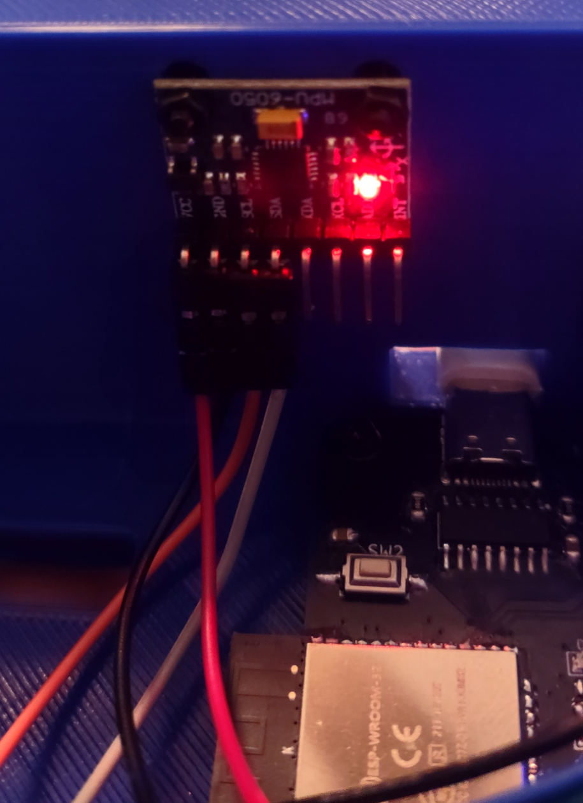

# ESP-IDF MPU6050

## ESP-32 drivers for MPU6050 IMUs. ##

The MPU6050 is a cheap, powerful, single board, I2C controlled IMU module that incorporates seven separate sensors: a three axis accelerometer, a three access gyroscope, and a temperature sensor.  Other ESP-IDF component libraries for this sensor [exist](https://github.com/MianIdrees/mpu6050_interfacing_with_ESP32_using_ESP-IDF/tree/main) and are very feature complete, however all of the ones I was able to find unfortunately use ESP-IDFs older I2C drivers instead of the new ones.  

&nbsp;

Somewhat recently (late 2024 I believe) Espressif added a second set of newer I2C drivers to ESP-IDF, due to their belief that the first version I2C driver had some inherent issues and wasn't easy to use ([see here](https://docs.espressif.com/projects/esp-idf/en/stable/esp32/api-reference/peripherals/i2c.html)).  You can still use the old I2C drivers, Espressif still includes them with ESP-IDF, however there is a stipulation; a project (and any components being used in that project) can only use one type of the driver.  A single project can't contain both the old and the new I2C drivers.

&nbsp;

I was recently working on project where I wanted to use an MPU6050, but I also wanted to use some ESP-IDF I2C based components that had been written with the new I2C drivers.  I was unable to find MPU6050 support using the new I2C drivers, so I wrote my own controller in my project instead of using an external component.  Having accomplished all that, I decided to go ahead and build it into this component myself with the hopes that others may have an easier time with this powerful module going forward.

&nbsp;

Licensed under the permissive MIT License, these drivers can be copied, used, modified, and distributed openly (even for commercial work).  Attribution and/or bug fixed upstreaming is appreciated, but is in no way mandatory.

---

<p align="center">
  
</p>

### Capabilities ###

What this driver can currently do:
 - Poll and wake up an MPU6050 IMU using either the default MPU6050 address of 0x68 or the alternate address of 0x69.
 - Configure that MPU6050 module for use, configuring the accelerometer sensitivity, the gyrosope sensitivity, and the sample rate.
   - Note that there are some stipulations about this, which I will discuss below.
 - Calibrate the accelerometer and the gyroscope sensors.  This is done during initialization (can be turned off if you'd prefer to do it once and just apply those values yourself, as it extends startup time by around 2 seconds, and requires holding the module level and steady during initialization time).
 - Get readings for all three axes of the accelerometer (in units of Earth gravitational constants, or Gs), all three axes of the gyroscope (in units of degrees per second), and the thermometer (in units of degrees celcius).

 What this driver cannot currently do:
  - Regarding the stipulation about MPU6050 initialization alluded to above, the MPU6050 can set the gyroscope to multiple separate sensitivities for both the accelerometer and the gyroscope.  I don't presently support this, and instead just always initialize the accelerometer to +/-2G sensitivity and the gyroscope to +/-250dps.  These are the most accurate readings for slow speed application, and they're what I need for the project I'm working on.  Variation here would be trivial to add and I may just do it anyway for fun, but while writing this I'm basically just setting up the basic component to accomplish what I need.
  - Similarly, the unit supports multiple sensor reading frequencies.  I always set the sensor frequency to 150Hz even though we may not end up needing that reading.  I could also change this, but it would be a little more involved as it would mess with the calibration sequence.
  - When using this sensor it's not typical to use the values that it provides directly.  Instead it's more common to do sensor integration, combining the readings of both the accelerometer and the gyro sensors, through a complementary filter or a Kalman filter and getting pitch and roll values that are more stable then the sensors individually provided accelerometer and gyro values.  I'd like to implement this in the library directly, and that's what I intend to do with this library going forward.

---

### Driver Usage ###

To use this driver in a project, simply drop the `MPU6050` directory from this repo into either your core esp-idf components directory, or (more typically) drop it into the `components` directory of the individual project.

An example of usage of this component can be found in this repo itself, in the [`MPU6050/examples/MPU6050_serial_read`](MPU6050/examples/MPU6050_serial_read) directory.  If you're using ESP-IDF through VSCode, open that folder in VSCode (instead of the root directory) and say okay at the prompt to generate `compile_commands.json`.

As stated above, this driver assumes you're using the ESP-IDF [i2c_master_controller](https://docs.espressif.com/projects/esp-idf/en/stable/esp32/api-reference/peripherals/i2c.html#i2c_master_controller) driver provided by Espressif.  So, in your main project, include the `driver/i2c_master.h` header from ESP-IDF and setup a `i2c_master_bus_handle_t` that defines I2C master bus object.  This gets passed into the MPU6050 library during initialization.  This will require picking GPIOs for the SDA and SCL lines.  These are typically either 21 and 22 respectively, but most other GPIO pins can be configured as I2C if desired.  Once the bus I2C bus has been created, define a `MPU6050_CONFIG` struct as follows:
```
MPU6050_CONFIG mpuConfig = {
    .sensor_address = MPU6050_SENSOR_ADDRESS, // By default this is 0x68, if pin AD0 is pulled 
                                                 high then this will be 0x69, which allows for 
                                                 two sensors to be on the bus simultaneouly.
    .should_calibrate = true,                 // True if you want to calibrate, false otherwise
    .calibration_axis = Z                     // Can be X, Y, or Z.  Pick the axis that is
                                              // perpendicular to the Earths surface in your application.
                                              // Axes are usually silkscreened on the module.
};
```
After creating this struct, initialize the MPU6050 by calling 
```
setup_mpu_sensor(&i2cConfig, &mpuConfig)
```
Passing in a reference to your i2c_master_bus_handle_t struct as well as your MPU6050_CONFIG struct.  This will cause the library to set up the MPU6050 I2C device on the bus, and will calibrate the MPU6050 if this was requested.

Calibration consists of taking several (default 200) readings over approximately two seconds, averaging those readings out, and then determining "offsets" between what the readings were and what they should have been.  These offsets are used in later readings to correct for sensor inaccuracy.  In order for this process to be accurate, during calibration the module MUST be kept:
 - steady, not rotating on any axis
 - level, with the axis that should be perpendicular to the Earth (and thus experiencing 1G of linear acceleration) facing the correct direction

After calibration, the module is up and ready for use.  Basic operation consists of three functions:

---

<details>
<summary><b>read_accel(double* accelReadings)</b></summary>
<h4>Description</h4>
Polls the sensor for accelerometer readings on the X, Y, and Z axes, converts them to 'G' units, and fills out the param double array with those values.  The only parameter for this function is an array of three doubles (ie. double accelReadings[3]).  When returned, the readings will be populated in the array with the X axis at index 0, the Y axis at index 1, and the Z axis at index 2.
</details>

---

<details>
<summary><b>read_gyro(double* gyroReadings)</b></summary>
<h4>Description</h4>
Polls the sensor for gyroscope readings on the X, Y, and Z axes, converts them to degrees per second units, and fills out the param double array with those values.  The only parameter for this function is an array of three doubles (ie. double gyroReadings[3]).  When returned, the readings will be populated in the array with the X axis at index 0, the Y axis at index 1, and the Z axis at index 2.
</details>

---

<details>
<summary><b>read_temp(double* tempReading)</b></summary>
<h4>Description</h4>
Polls the sensor for the temperature reading, converts it to units of degrees celsius, and fills out the param double pointer with that value.  The only parameter for this function is a pointer to a double.
</details>

